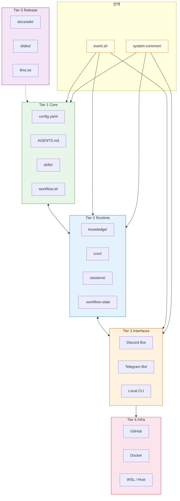
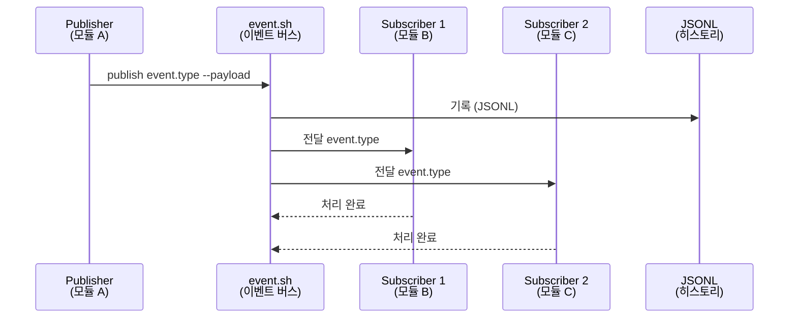

# 시스템 아키텍처 레퍼런스

## 한 줄 요약

5계층 레이어드 아키텍처에 기반한 AI 에이전트 운영 시스템의 설계도 — 계층별 책임, 디렉토리 맵, 이벤트 버스, 설계 원칙을 한 자리에서 확인합니다.

## 기본 개념

p-hermes는 Tier 1 Core → Tier 2 Runtime → Tier 3 Interfaces → Tier 4 Infra → Tier 5 Release의 5계층 구조로 나뉩니다. 각 계층은 독립적인 생명주기를 가지며, 상위 계층이 하위 계층에 의존하는 방향으로 설계됩니다. 물리적 경로 추상화(`$HERMES_ROOT`), 이벤트 기반 통신(`event.sh`), 심링크 금지가 세 가지 설계 원칙입니다.

## 문제 상황

레이어드 구조 도입 전에는 모든 스크립트와 설정 파일이 단일 디렉토리에 혼재되어 있었습니다. 파일 간 의존성이 명시되지 않아 한 파일 수정이 예상치 못한 곳에서 오류를 발생시켰고, 새로운 기능 추가 시 기존 코드와의 충돌을 사전에 발견하기 어려웠습니다. 또한 절대 경로 하드코딩으로 인해 환경 간 이동(WSL ↔ macOS) 시 전체 경로를 수정해야 했습니다.

## 기술 설계

레이어드 구조는 다음 핵심 요소로 구현됩니다. `workflow.sh` 기반 9-Step 상태 머신이 Core 계층에서 워크플로우를 제어하고, `event.sh`가 모듈 간 단일 진입점으로 동작하는 Pub/Sub 이벤트 버스를 제공합니다. `system-common/lib/`는 모든 계층이 공유하는 원자적 파일 작성, 뮤텍스, 로그 유틸리티를 포함합니다. `config.yaml`과 `AGENTS.md`는 시스템 전역 설정의 단일 진실 공급원(SSOT)으로 모든 계층이 참조합니다.

## 구조/흐름도

레이어드 구조의 계층별 구성과 의존 관계를 시각화합니다.



## 활용 예시

### 새로운 스킬 추가
Core 계층의 `skills/` 디렉토리에 새 모듈을 배치하면 자동으로 인식됩니다. 별도 설정 파일 수정 없이 이벤트 버스를 통해 기존 모듈과 통신합니다.

### Cron 자동화 작업 추가
Runtime 계층의 `cron/registry.yaml`에 새 작업을 등록하면 실행 큐에 포함됩니다. 스케줄 문법과 모델 지정, 결과 전달 채널을 YAML로 정의합니다.

### Discord 인터페이스 추가
Interfaces 계층에 새 채널 설정을 추가하면 Core 계층 변경 없이 외부 통신이 확장됩니다. 모든 인터페이스는 동일한 `event.sh`를 통해 Core와 통신합니다.

## 1. 서론

p-hermes는 레이어드 구조 아키텍처에 기반한 AI 에이전트 운영 시스템이다. 계층화된 설계는 각 계층이 명확한 책임 범위를 보유하도록 구성하며, 모듈 간 결합도를 낮추는 것이 핵심 목표이다. 시스템 설계는 세 가지 원칙에 기반한다. 첫째, 모든 물리적 경로는 `$HERMES_ROOT` 환경 변수를 통해 추상화한다. 둘째, 모듈 간 통신은 `event.sh`를 단일 진입점으로 사용하는 이벤트 기반 패턴을 따른다. 셋째, 심링크는 사용하지 않으며 모든 파일 참조는 물리적 경로를 기반으로 수행한다. 이 문서에서는 레이어드 구조 구조의 계층별 책임, 디렉토리 맵, 설계 원칙, 이벤트 버스 및 system-common 개념, 안티패턴, 확장성, FAQ를 기술한다.

## 2. 레이어드 구조 구조

p-hermes 시스템은 하단에서 상단으로 Tier 1 Core → Tier 2 Runtime → Tier 3 Interfaces → Tier 4 Infra → Tier 5 Release의 레이어 계층으로 구성된다. 각 계층은 독립적인 생명주기를 가지는 동시에 상위 계층이 하위 계층에 의존하는 방향으로 설계된다.

**Tier 1 Core**는 시스템의 핵심 워크플로우 엔진을 담당한다. `workflow.sh` 기반 9-Step 상태 머신, spec-driven 개발 파이프라인, expression 시스템, 그리고 `skills/` 디렉토리에 배치된 스킬 정의 파일이 포함된다. `config.yaml`과 `AGENTS.md`는 시스템 전역 설정을 정의하며 모든 계층이 참조하는 단일 진실 공급원(SSOT) 역할을 수행한다.

**Tier 2 Runtime**은 실행 시간 데이터와 상태 관리를 담당한다. `knowledge/`는 학습된 지식을 저장하며, `cron/`은 자동화 작업 레지스트리와 실행 이력을 관리한다. `sessions/`는 대화 세션 상태를 유지하고, `.workflow-state`는 현재 실행 중인 워크플로우의 상태 트랜지션을 기록한다.

**Tier 3 Interfaces**는 외부와의 통신 채널을 제공한다. Discord 봇, Telegram 봇, 그리고 로컬 CLI 인터페이스가 포함되어 있다. 각 인터페이스는 동일한 이벤트 버스를 통해 Core 계층과 상호작용하며, 프로토콜 차이는 인터페이스 계층 내부에서 처리된다.

**Tier 4 Infra**는 실행 환경과 지속화 계층을 담당한다. GitHub는 코드 저장소 및 CI/CD 파이프라인으로 동작하고, Docker는 격리된 실행 환경을 제공한다. WSL/Host 환경은 Windows 기반 개발 시스템에서의 실행을 지원한다.

**Tier 5 Release**는 배포 가능한 산출물을 관리한다. `docs/`는 기술 문서와 Wiki 페이지를 포함하고, `wiki/`는 참조용 구조화된 문서를 배치한다. `slides/`는 프레젠테이션 자료를 관리하며, `llms.txt`는 LLM 접근용 메타데이터 인덱스를 자동 생성한다.

```mermaid
graph LR
    subgraph Core["Core 레이어"]
        C1["config.yaml"]
        C2["AGENTS.md"]
        C3["skills/"]
        C4["workflow.sh"]
    end
    subgraph Runtime["Runtime 레이어"]
        R1["knowledge/"]
        R2["cron/"]
        R3["sessions/"]
    end
    subgraph Interfaces["Interfaces 레이어"]
        I1["Discord"]
        I2["Telegram"]
        I3["CLI"]
    end
    subgraph Infra["Infra 레이어"]
        IF1["GitHub"]
        IF2["Docker"]
        IF3["WSL"]
    end
    subgraph Release["Release 레이어"]
        RL1["docs/"]
        RL2["slides/"]
        RL3["llms.txt"]
    end
    
    Core <--> Runtime
    Runtime <--> Interfaces
    Interfaces --> Infra
    Release -.-> Core
```



## 3. 디렉토리 맵

각 계층은 `$HERMES_ROOT` 아래에 배치된 디렉토리 구조를 따라 조직된다. 다음 구조는 계층별 파일 배치 관계를 나타낸다.

```
$HERMES_ROOT/
├── config.yaml              # Core 레이어 — 전역 설정
├── AGENTS.md                # Core 레이어 — 에이전트 정의
├── skills/                  # Core 레이어 — 스킬 라이브러리
│   ├── skill-a/
│   └── skill-b/
├── workflow.sh              # Core 레이어 — 워크플로우 엔진
├── knowledge/               # Runtime 레이어 — 지식 저장소
│   ├── input/
│   └── output/
├── cron/                    # Runtime 레이어 — 자동화 작업
│   ├── registry.yaml
│   └── jobs/
├── sessions/                # Runtime 레이어 — 세션 상태
│   └── active/
├── .workflow-state          # Runtime 레이어 — 상태 파일
├── interfaces/              # Interfaces 레이어 — 통신 채널 설정
│   ├── discord/
│   └── telegram/
├── infra/                   # Infra 레이어 — 인프라 설정
│   ├── docker/
│   └── github-actions/
├── docs/                    # Release 레이어 — 문서
│   ├── wiki/
│   └── slides/
├── llms.txt                 # Release 레이어 — LLM 메타데이터
├── event.sh                 # 전역 — 이벤트 진입점
└── system-common/           # 전역 — 공통 유틸리티
    └── lib/
```

환경 변수를 사용한 경로 참조 예시:

```bash
export HERMES_ROOT="$HOME/.hermes"
CORE_CONFIG="$HERMES_ROOT/config.yaml"
WORKFLOW_STATE="$HERMES_ROOT/.workflow-state"
CRON_REGISTRY="$HERMES_ROOT/cron/registry.yaml"
```

## 4. 설계 원칙

시스템 설계는 다음 세 가지 원칙을 따르며, 모든 모듈과 스크립트는 이 원칙에 부합하도록 작성된다.

**심링크 금지**. 파일 시스템 참조는 물리적 경로만 사용한다. 심링크는 환경 간 경계에서 파괴되기 쉽며, 경로 분해 시 의도하지 않은 오류를 발생시킨다. 모든 스크립트는 `readlink -f` 또는 절대 경로를 통해 물리적 파일을 직접 참조한다.

**`$HERMES_ROOT` 추상화**. 절대 경로를 하드코딩하지 않으며, 모든 경로 구성은 `$HERMES_ROOT` 환경 변수를 기반으로 수행한다. WSL 환경과 macOS 환경 간 호환성을 유지하기 위해, 상대 경로와 환경 변수 조합을 사용하는 것이 표준 관례이다.

```bash
# 올바른 경로 구성 방식
EVENT_LOG="$HERMES_ROOT/sessions/events.log"
SKILL_DIR="$HERMES_ROOT/skills/${SKILL_NAME}"
```

**이벤트 기반 통신**. 모듈 간 상태 전달은 이벤트 버스를 통해 비동기로 수행된다. 직접 스크립트 호출을 통해 동기적 종속성을 생성하지 않으며, 모든 상태 변경은 이벤트 발행-구독 패턴을 따른다. 이 원칙은 계층 간 결합도를 낮추고 독립적 배포를 가능하게 한다.

**단일 진실 공급원(SSOT)**. `config.yaml`과 `AGENTS.md`는 시스템 전역 설정의 단일 진실 공급원이다. 중복 설정 파일을 생성하지 않으며, 모든 계층은 이 두 파일을 참조하여 동작 매개변수를 확인한다.

**원자성 보장**. 상태 파일 작성은 원자적 원리로 수행된다. 임시 파일에 작성 후 `mv` 명령어로 이동하는 방식을 통해 중간 상태를 노출하지 않으며, `system-common` 라이브러리가 제공하는 원자적 작성 유틸리티를 사용한다.

## 5. 이벤트 버스 개념

이벤트 버스는 `event.sh`를 단일 진입점으로 사용하는 퍼블리시-서브스크라이브(Pub/Sub) 패턴을 구현한다. 모든 모듈은 `event.sh`를 통해 이벤트를 발행하거나 구독하며, 직접적인 모듈 간 호출을 수행하지 않는다.

`event.sh`는 시스템 아키텍처에서 다음과 같은 역할을 수행한다. 첫째, 모든 상태 변경 이벤트를 중앙 집중식으로 라우팅하여 모듈 간 결합도를 낮춘다. 둘째, 이벤트 내용을 JSONL 형식으로 기록하여 전체 시스템의 실행 이력을 추적 가능하게 한다. 셋째, 이벤트 구독자를 동적으로 등록하거나 해제할 수 있어 시스템 동작을 실행 시간에 변경할 수 있다.

```bash
# 이벤트 발행
$HERMES_ROOT/event.sh publish workflow.started \
  --payload '{"job_id": "JOB-0042", "step": "request"}'

# 이벤트 구독
$HERMES_ROOT/event.sh subscribe workflow.completed \
  --handler "$HERMES_ROOT/cron/notifier.sh"

# JSONL 히스토리 조회
tail -20 "$HERMES_ROOT/sessions/events.jsonl"
```

JSONL 히스토리 파일은 각 이벤트의 타임스탬프, 이벤트 유형, 페이로드를 포함하여 기록한다. 시스템 장애 시 히스토리를 통해 문제 발생 시점을 추적하며, 이벤트 재생을 통한 상태 복구를 지원한다.



## 6. system-common 개념

`system-common`은 모든 계층이 공유하는 공통 유틸리티 라이브러리이다. `$HERMES_ROOT/system-common/lib/` 경로에 배치되며, 스크립트에서 `source` 명령어로 직접 포함하여 사용한다.

**mkdir atomic mutex**. 디렉토리 생성과 잠금 관리를 결합한 유틸리티로, 경쟁 조건(race condition)이 발생하는 동시 실행 환경에서 안전하게 디렉토리를 생성하고 상호 배제를 보장한다. `mkdir -p`와 파일 기반 뮤텍스를 결합하여 원자적으로 디렉토리 초기화를 수행하며, 이미 존재하는 디렉토리의 경우 무조건 성공 처리한다.

```bash
# system-common 포함 예시
source "$HERMES_ROOT/system-common/lib/utils.sh"
source "$HERMES_ROOT/system-common/lib/atomic.sh"

# 원자적 디렉토리 생성 + 뮤텍스
atomic_mkdir "$HERMES_ROOT/sessions/new-session"
```

**공통 유틸리티**. 로그 기록, 원자적 파일 작성(`atomic_write`), 환경 변수 검증, 경로 정규화 기능을 제공한다. 모든 유틸리티 함수는 `$HERMES_ROOT` 의존성을 내부적으로 처리하며, 호출 측에서 경로를 직접 구성할 필요가 없다.

## 7. 안티패턴

다음 패턴은 시스템 설계 원칙과 충돌하며 사용이 금지된다.

**절대 경로 하드코딩**. `/home/user/.hermes/config.yaml`와 같이 사용자 환경에 고정된 경로를 스크립트에 포함하지 않는다. `$HERMES_ROOT` 환경 변수를 사용하며, 경로를 구성하는 함수를 `system-common`에서 제공한다.

**심링크 생성**. `ln -s` 명령어로 심링크를 생성하지 않는다. 심링크는 환경이 변경될 때 무효화되며, 경로 분해 시 의도하지 않은 동작을 유발한다. 물리적 파일 복사 또는 환경 변수 기반 경로 구성을 사용한다.

**직접 스크립트 호출**. 모듈 A가 모듈 B의 스크립트를 직접 실행하는 구조를 생성하지 않는다. 모듈 간 상호작용은 `event.sh`를 통한 이벤트 발행-구독 패턴을 통해 수행하며, 동기적 종속성을 방지한다.

## 8. 확장성

레이어드 구조 아키텍처는 수평적 확장을 지원한다. 각 계층은 독립적으로 버전 관리 및 배포가 가능하며, 이벤트 기반 통신이 모듈 간 느슨한 결합을 보장한다. 새로운 인터페이스 추가 시 Tier 3 계층만 수정하면 되며, Core 계층의 변경이 불필요하다. 스킬 확장 시 `skills/` 디렉토리에 새 모듈을 배치하면 자동 인식되며, Cron 자동화 추가 시 `cron/registry.yaml`에 등록하면 실행 큐에 포함된다.

## 9. FAQ

**Q: 새로운 계층을 추가하려면 어떻게 해야 하나요?**
A: 레이어드 구조 구조는 명확한 책임 경계를 가지므로, 기존 계층의 책임을 분리하거나 통합하는 형태로 접근한다. 이벤트 버스를 통해 기존 계층과 통신하도록 설계하며, `config.yaml`에 새 계층의 설정을 등록한다.

**Q: `$HERMES_ROOT` 환경 변수가 설정되지 않은 경우 어떻게 동작하나요?**
A: `system-common/lib/utils.sh`는 `$HERMES_ROOT`가 미설정 시 `~/.hermes`를 기본값으로 사용하며, 로그에 경고 메시지를 기록한다. 모든 유틸리티 함수는 이 기본값 처리를 내부적으로 수행한다.

**Q: 이벤트 버스 장애 시 시스템이 어떻게 복구하나요?**
A: `event.sh`는 비동기 이벤트 처리를 사용하므로 단일 이벤트 실패가 전체 시스템을 차단하지 않는다. 실패한 이벤트는 JSONL 히스토리에 상태와 함께 기록되며, 재실행 스크립트가 히스토리를 스캔하여 미처리 이벤트를 재처리한다.

---

## 관련 문서

- [5계층 아키텍처 설계 철학](../blog/posts/architecture-layered.md) — 아키텍처 설계 배경과 교착 상태 문제 분석
- [워크플로우 가이드](guides/request-task.md) — 9-Step 상태 머신 동작 흐름과 승인 게이트
- [아키텍처 슬라이드](../slides/decks/architecture-layered.html) — 레이어드 구조 시각화 및 핵심 개념
